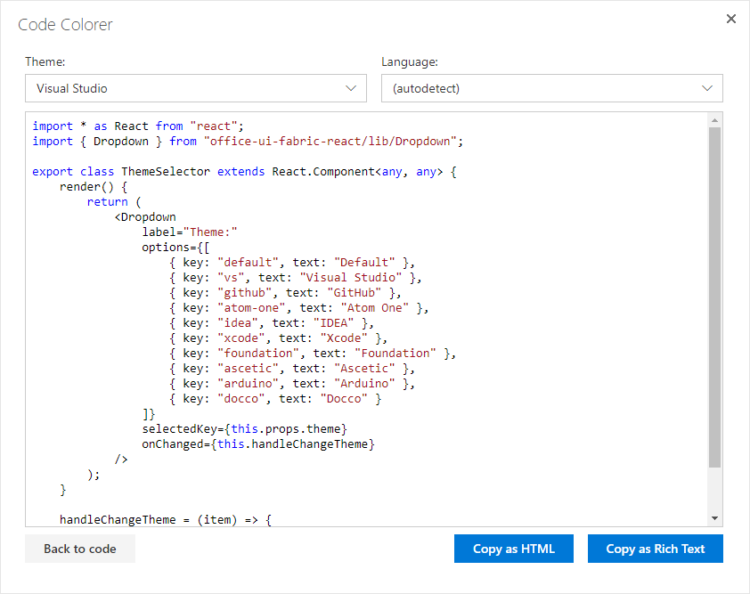

# SPCodeColorer
SPCodeColorer is a SharePoint add-in that allows to apply syntax highlighting to source code you provide.

Editors and technical writers who work with SharePoint often need to insert pieces of source code into pages. For example, this is the case with maintaining Wiki based KB. Usually, they have to use external tools for syntax highlighting. SPCodeColorer allows to get highlighed code without switching to any other application or site.

## Supported platforms
- SharePoint 2013
- SharePoint 2016
- SharePoint Online

## Features
- This project uses SharePoint Add-in model.
- This tool is implemented as SharePoint hosted add-in.
- It’s accessible from the Ribbon, just open page in edit mode and click **Highlight** button.
- It works in its own dialog box, so it does not affect page’s content directly. Instead, it allows to copy highlighted code to clipboard.
- You can copy hightlighted code as Rich Text or HTML.
- 10 themes and 18 code languages are supported.
- In most cases, you don’t need to specify code language manually, autodetect does it for you.

## Used frameworks and libraries
- [React](https://facebook.github.io/react/)
- [Office UI Fabric React](https://dev.office.com/fabric)
- [Highlight.js](https://highlightjs.org)
- [clipboard.js](https://clipboardjs.com)
- [Notyf](http://carlosroso.com/notyf/)

## License
SPCodeColorer in under [MIT license](LICENSE).
